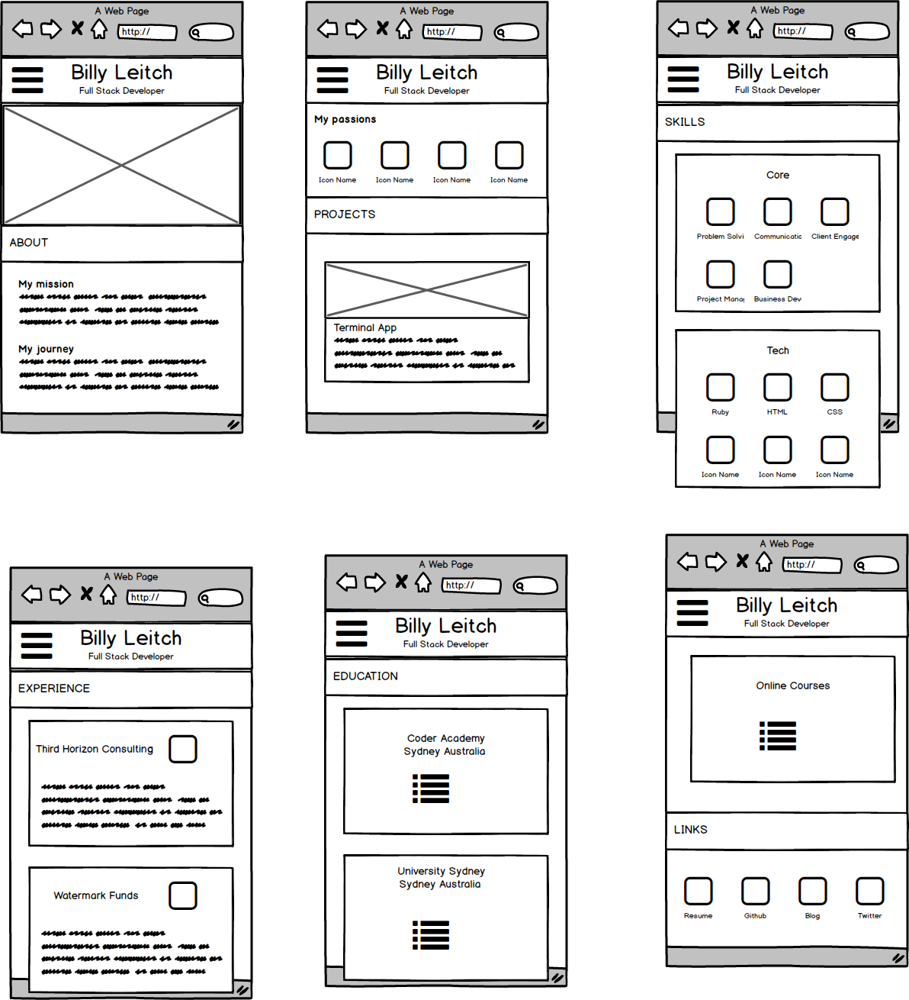

<h1> Billy Leitch's Portfolio Website<h1>
    <h3>
        https://wlei6277.github.io/
    </h3>
    <h2>
        Overview
    </h2>
    <h3>
        Purpose
    </h3>
    <ul>
        <li>Demonstrate abilities in web development and design</li>
        <li>Provide an easy to navigate one-stop-shop to view a summary of all my projects</li>
        <li>Outline my passions and personality</li>
        <li>Communicate past skills, past experience and education</li>
        <li>Link contact details and media accounts</li>
    </ul>
    <h3>
        Functionality / Features
    </h3>
    <ul>
        <li>Linked navigation bar which comes on to the screen when the user clicks on the 'hamburger' menu in the top left of the screen </li>
        <li>Links to web development projects (found in the 'Projects' section</li>
        <li>Links to previous employers (found in the 'Experience' section)</li>
        <li>Links to education providors (found in the 'Education' section)</li>
        <li>Links to media accounts (found in the 'Contact' section)</li>
        <li>Media breaks to adjust size of navigation bar and page elements (e.g. key strengths section) to optimise for desktop screen sizes</li>
    </ul>
    <h3>
        Sitemap and Screenshots
    </h3>

<h3>
    Target Audience
</h3>
<ul>
    <li>Recruiters</li>
    <li>Colloborators on projects</li>
    <li>Students and collegues</li>
    <li>Friends and family</li>
</ul>
<h3>
    Technology stack
</h3>
<ul>
    <li>HTML5</li>
    <li>CSS3</li>
    <li>SaS</li>
    <li>Javascript</li>
</ul>
<h2>
Design Documentation
</h2>
<h3>
	Design process
</h3>
​	
​	

<h3>
    Wireframes
</h3>
​	
<h3>
    Usability considerations
</h3>
<ul>
    <li>All images have an alt attribute to assist those who are unable to view these elements</li>
    <li>All hyperlinks have aria-label attribute to describe the click action</li>
    <li>Each major section has a role attribute to assist site naviagation for visually impaired users</li>
</ul>
<h3>
    Planning Process
</h3>

<h2>
    Question and Answer
</h2>
<h3>
    Describe key events in the development of the internet from the 1980s to today
</h3>
 

    1980 -1994: protocols for computers to exchange information are launched on wide scale(e.g. Simple Mail Transfer Protocol). The Bulletin Boards system also became popular when prices for modems became low enough for average people to afford them.  Up until this point however computer information exchange was mostly within government and academic institutions.

    1994 - 2000:  In 1994 the internet goes live and the mosaic web browser is launched along with web pages. As the popularity of the internet explodes so does the commercial ecosystem around it - browsers such as Microsoft's Internet Explorer and Mozilla Firefox are born. The potential applications for the internet expand fueling investment and the dot-com bubble.

    2000-2019: The dot-com crash occurs and the internet is reborn with web 2.0. Social Networking begins to rise in popularity. The web is now a foundation for society to connect and share information.  

<h3>
    Define and describe the relationship between fundamental aspects of the internet
</h3>

<ul>
    <li>Clients: are web users connected internet devices</li>
	<li>Browsers: allow clients to access the internet by retrieving resources from web servers and displaying them on the users device.</li>
	<li>Servers: are computers which store data, webpages or applicatons</li>
	<li>Internet: is the infrastructure which facilitates the exchange of information between computers. Physically this cabling or satelite signals in which data is transferred between computers in a network.</li>
	<li>TCP/IP: are protocols which define how data should travel across the internet</li>
	<li>Domain Name Servers: a location system like an adress book which enables a server to be located by a client. This is akin to the need for a postal address on parcel for the post office to send the package to intended address.	</li>
</ul>
<h3>
    Reflect on one aspect of the development of internet technologies and how it has contributed to the world today
</h3>

    Web mapping services: although web mapping applications have been around since 1989 they didn't become fully mainstream until the successful launch of Google Maps. Web mapping services have totally transformed how we navigate the physical world and geographies across the globe. Using traditional navigation media (e.g. paper map) a user can only see a pre-defined route or location. Providing the user with a live update of their location enables far greater flexibility in use of the map and usefullness in navigating to a desired location.

 

   Key benefits of web mapping services include:         

<ul>
    <li>Enables users to easily store, modify and share information about geographies and locations</li>
    <li>Enables an ecosystem of technologies and businesses which are based around a shared mapping system (e.g. Uber, Airbnb, Domain etc..)</li>
    <li>Enable organisations to reach out to and be located by relevant customers</li>

